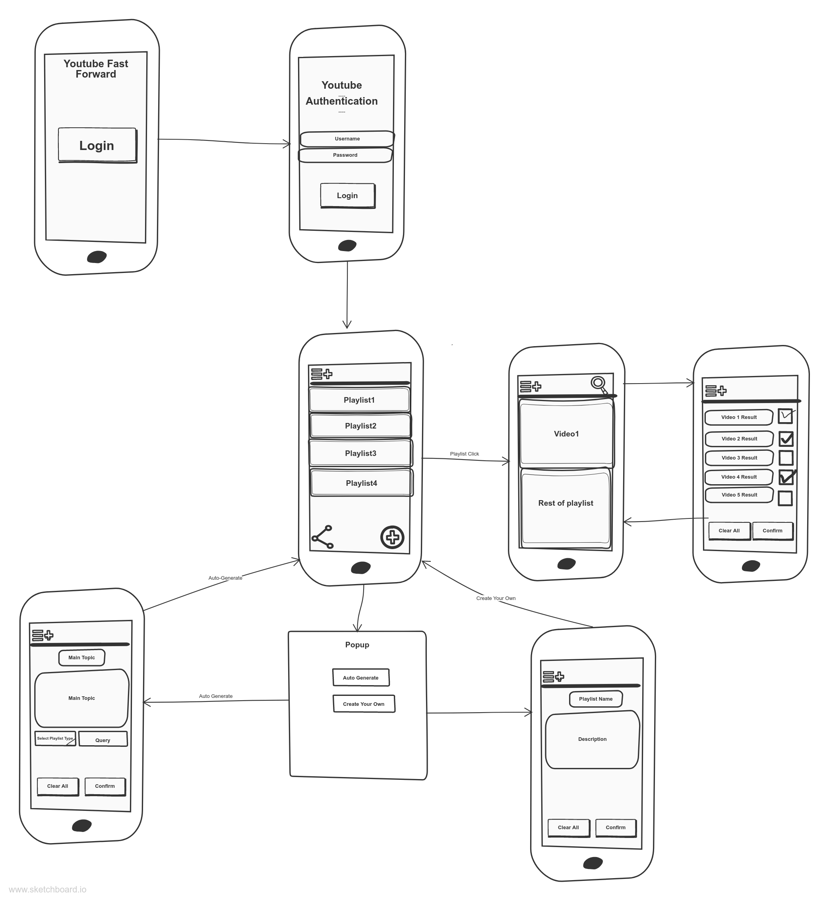

Original App Design Project - README Template
===

# Youtube Fast Forward

## Table of Contents
1. [Overview](#Overview)
1. [Product Spec](#Product-Spec)
1. [Wireframes](#Wireframes)
1. [Schema](#Schema)

## Overview
### Description

Let's an indivudal create a Youtube Playlist. This includes adding videos and deleting videos from a Youtube Playlist. They will have the ability to also share their favorite playlists as well.

### App Evaluation
[Evaluation of your app across the following attributes]
- **Category:** Social/Statistics
- **Mobile:** This app would be primarily developed for mobile. 
- **Story:** Aids users in creating Youtube Playlists.The user can then decide to share with other people and befriend them.
- **Market:** individuals will have the option to share with friends and on their own social media pages.
- **Habit:** This application displays Youtube playlists that the user has created and allows them to play videos.
- **Scope:** First we would let the user create and share video playlists. Then we would allow them to play videos from these playlists. Perhaps in a future rendition of the app, we will showcase stats concerning the user's video watching habbits.

## Product Spec

### 1. User Stories (Required and Optional)

**Required Must-have Stories**

* Users login to access information about their Youtube playlists that were created on this app.
* User will view a variety of their Youtube playlists
* Users will be able to add a new Youtube Playlist
* Users will be able to add and delete videos from a specified Youtube Playlists
* Users will have the option to share the statistics with other people.

**Optional Nice-to-have Stories**

* Users can view their watching habbit stats

### 2. Screen Archetypes

* Login Screen
    * User can login to their Youtube account
* Main Screen 
    * Displays main statistics
* Settings Screen
    * Lets people change language, and app notification settings.
* Playlist Creation
    * Creates PlayList

### 3. Navigation

**Tab Navigation** (Tab to Screen)
* Profile
* Settings

**Flow Navigation** (Screen to Screen)

* Forced Log-in (Authenticate With Youtube) -> YT Playlists
* Settings -> Toggle settings

# To-Do (Unit 6)
## Wireframes
[Add picture of your hand sketched wireframes in this section]

## Schema 
[This section will be completed in Unit 9]
### Models
Playlist Model
| Property | Type | Description |
| -------- | -------- | -------- |
| Playlist ID| Int    | Identifer for playlist |
| title      | String  | Name of playlist           |
| description| String | Description of the playlist |
| videoList  | List[Video Model] | Container for all the video that exists in the list |

Video Model
| Property | Type | Description |
| -------- | -------- | -------- |
| title    | String   |The title of the video     |
| video id |   Int    |The id for a video      |
| url      | String   |The link to the Youtube Video|

### Networking
- Login Screen
    - (OAuth2.0) Google services
- PlayList display Screen
    - load and fill playlist 
        - GET https://youtube.googleapis.com/youtube/v3/playlists?part=snippet&part=id&mine=true&key=[YOUR_API_KEY] HTTP/1.1

Authorization: Bearer [YOUR_ACCESS_TOKEN]
Accept: application/json
- Video Display Screen 
    - get videos from playlist
        - GET https://youtube.googleapis.com/youtube/v3/playlistItems?part=id&maxResults=41&playlistId=PLNoeAqD_4zeZ9Nz35mlzVtjo5Q8lENuZ3&key=[YOUR_API_KEY] HTTP/1.1

    Authorization: Bearer [YOUR_ACCESS_TOKEN]
    Accept: application/json
- Add Video Screen
    - get videos based on the user's video search
        - GET https://youtube.googleapis.com/youtube/v3/search?part=snippet&maxResults=10&q=UC%20Irvine&key=[YOUR_API_KEY] HTTP/1.1
    - Add videos from check list to playList
        - insert
            - POST https://youtube.googleapis.com/youtube/v3/playlistItems?part=snippet&key=[YOUR_API_KEY] HTTP/1.1
- Creation screens
    - Manual
        - Creation
            - below
    - Auto
        - Creation
            - POST https://youtube.googleapis.com/youtube/v3/playlists?part=snippet%2Cstatus&key=[YOUR_API_KEY] HTTP/1.1
        - insert
            - POST https://youtube.googleapis.com/youtube/v3/playlistItems?part=snippet&key=[YOUR_API_KEY] HTTP/1.1

Authorization: Bearer [YOUR_ACCESS_TOKEN]
Accept: application/json
Content-Type: application/json

{
   "snippet": {
    "playlistId": "YOUR_PLAYLIST_ID",
    "position": 0,
    "resourceId": {
      "kind": "youtube#video",
      "videoId": "M7FIvfx5J10"
    }
  }
}

- [OPTIONAL: List endpoints if using existing API such as Yelp]
